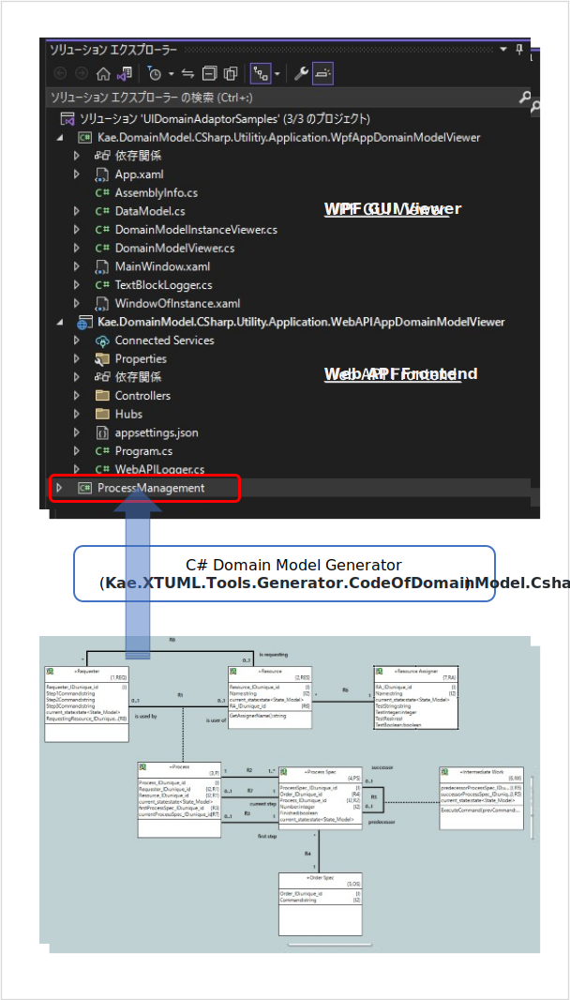
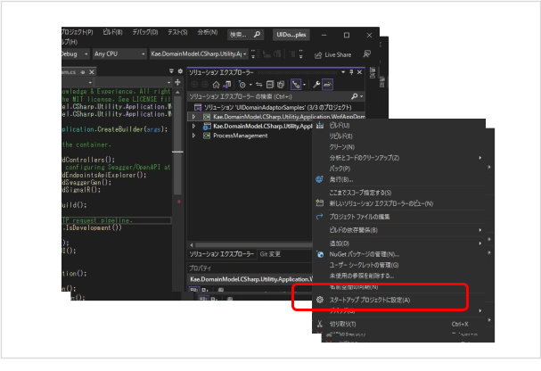
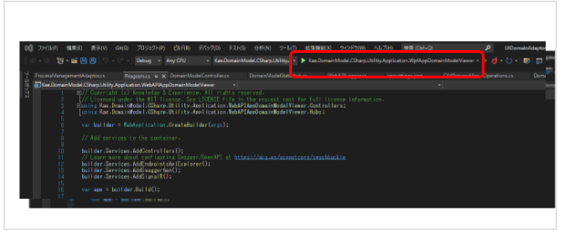
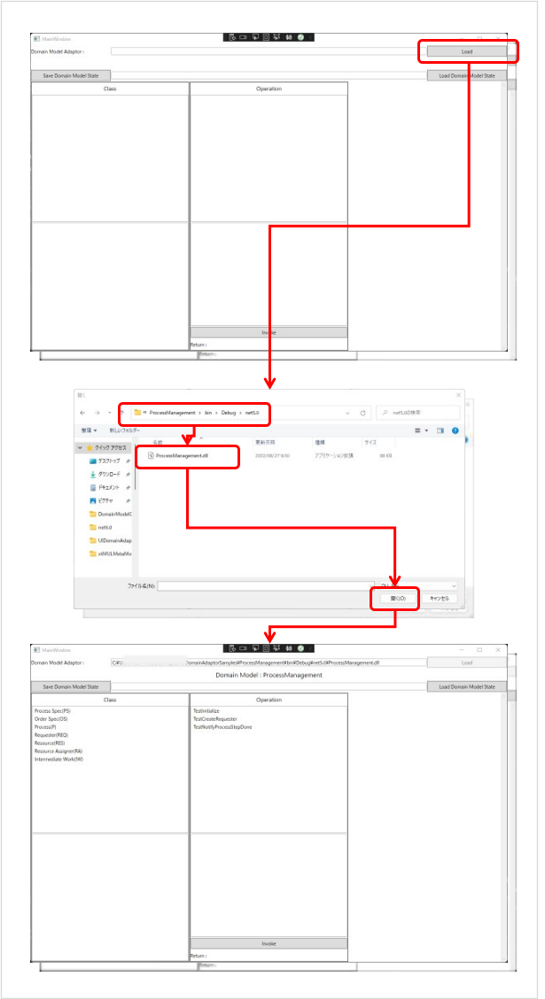
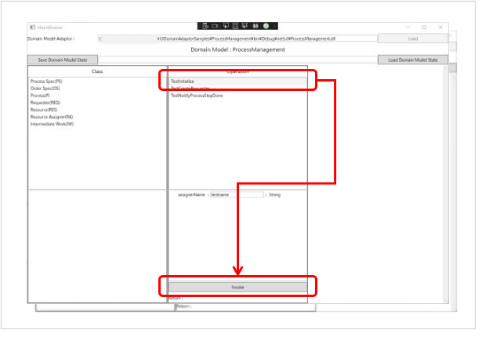
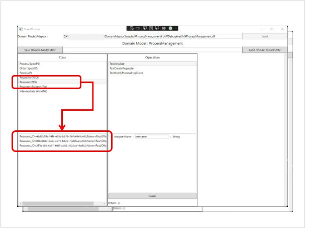
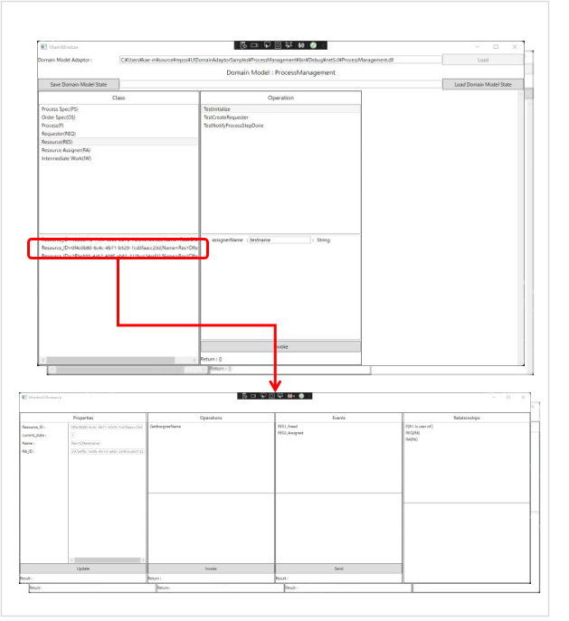
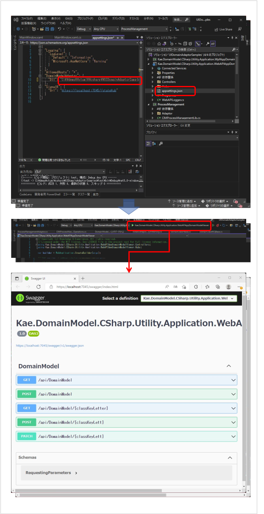
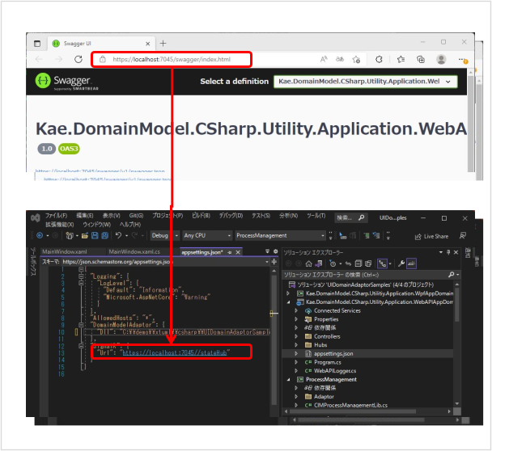

# Domain Model C# Adaptor Samples  
Domain Model Adaptor Samples for C#  
Projects of [UIDomainAdaptorSamples](./UIDomainAdaptorSamples/) structure is as follows.  
  

The "ProjectManagement" project is generated from [TestModel/ProcessManagement](./TestModel/ProcessManagement/), which is made by [BridgePoint](https://github.com/xtuml/bridgepoint)(eXcutable and Translatable UML Tool), by [Kae.XTUML.Tools.Generator.CodeOfDomainModel.Csharp](https://github.com/kae-made/domainmodel-code-generator-csharp) Generator.  

※ Please see https://note.com/kae_made/n/nded84b8ec643 to know the detail of the generator. (sorry for written by Japanese)  

This C# Generator generate adapoter class for frontend applications. Following two application projects use it to access auto generated domain model library.  
- Kae.DomainModel.Csharp.Utility.Application.WpfAppDomainModelViewer
    - GUI standalone Application using WPF.
- Kae.DomainModel.Csharp.Utility.Application.WebAPIAppDomainModelViewer
    - Web API Application using ASP.NET Core framework.

These two application can be used for any Conceptual Model for specific Domain because these code are completely independent for subject matter of each domain.  

※ Please see "[Art of Conceptual Modeling](https://note.com/kae_made/m/m054c9f9f8b61)" to know what is conceptual model.  

※ Please see "[Essence of Software Design](https://note.com/kae_made/m/m2e74d05de8b0)" to know design principles and rationale of code generation or related several libraries.  

---
## How to use.
Please clone or download this repository. Then open [UIDomainAdaptorSamples/UIDomainAdaptorSamples.sln](./UIDomainAdaptorSamples/UIDomainAdaptorSamples.sln).

Set the project you wan to run as the startup project on the solution view.  

---
### Kae.DomainModel.Csharp.Utility.Application.WpfAppDomainModelViewer  
Run the project as follows after startup setting.  
  

1. Load domain model.  
Click 'Load' button in the top right corner and select DLL file of ProjectManagement project.  

  

This application load dll file and find adaptor class. Then get classes and domain operations defined in domain conceptual model and show them.  

2. Run domain operation.  
When you select one of the domain operations displayed in the list box, the arguments are displayed, so set values of them and click the 'Invoke' button to execute the selected operation and display the result in the text block under the list box.  
  

 3. Show instances of domain classes.  
 When you select one of the domain class displayed in the left list box, existing instances of the domain class are displayed.  
   

 4. Show and access to instance.  
 When you select one of the domain class instances, viewer for the instance appears.  
   
 By this viewer, you can see/update property values, invoke class operation, send event and show linked instances by relationship id and phrase.  
 When you select one of linked instances, another viewer for the instance will be opened.  

 ---
 ### Kae.DomainModel.Csharp.Utility.Application.WebAPIAppDomainModelViewer  
 Before run this project, open the appsettings.json and update 'Dll' section of 'DomainModelAdapter' by file path of ProjectManagement/bin/Debug/net5.0/ProjectManagement.dll.  
 After this, run the project.  

APS.NET Core Web API app support swagger so you can access domain model by that.  

- GET /api/DomainModel
    - Get specifications of classes and domain operations.
- POST /api/DomainModel
    - Invoke domain operation. Necessary parameters are 'name'(name of domain operation) and 'parameters'(arguments of the domian operation)
- GET /api/{classKeyLetter}
    - Get instances of domain class specified by classKeyLetter.
- POST /api/{ClassKeyLetter}
    - Get properties, invoke class operation, send event or linked instanes of specific instance of domain class speified by classKeyLetter. feature is selected by 'opType'
        - instance
            - Get properties of the instance specified by 'identities'
        - operation
            - Invoke class operation of the instance specified by 'identities'. 'name' is name of class operation and 'parameters' are arguments of the operation.
        - event
            - Send event to the instance specified by 'identities'. 'name' is event name (<i>ClassKeyLetter</i>><i>EventNumber</i>:<i>Meaning</i>) and 'parameters' are supplemental data of the event.
        - linked
            - Get linked instances of the instance specified by 'identities'. 'name' is Relationship ID and Phrase.

#### Setting SignalR Hub  
Domain model's state update notification can be raceived via SignalR 'stateHub'.
To use this feature, please set "Url" section of "SignalR" in the appsettings.json.
  
You can get notification via  
- 'InstanceUpdated'
    - Instance creation, deletion, properties updated.
- 'RelationshipUpdated'
    - Relationship creation and deletion.

For more information about SignalR, please see [here](https://docs.microsoft.com/ja-jp/aspnet/signalr/overview/guide-to-the-api/hubs-api-guide-net-client).  

---
※ Documentation of how this work will be published soon.
